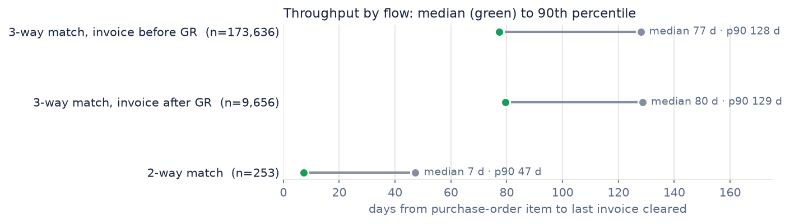
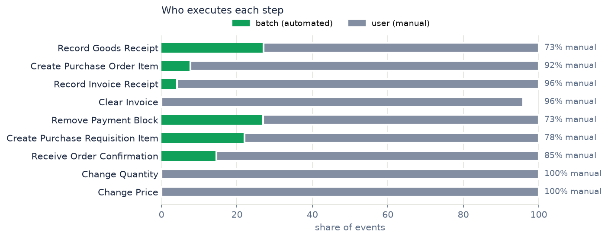
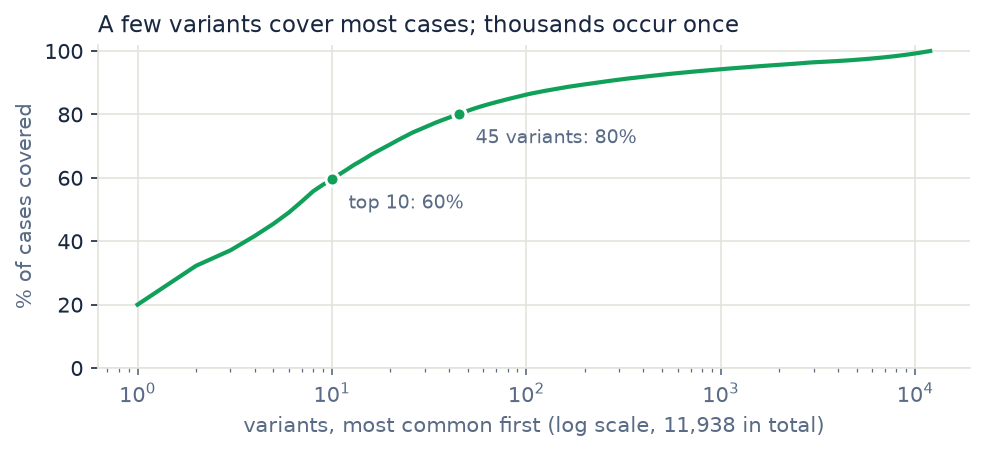

# Purchase-to-pay process mining on a real purchasing log

What does a purchasing process look like once you stop reading the process manual and start reading the event log? This repo takes the public [BPI Challenge 2019](https://doi.org/10.4121/uuid:d06aff4b-79f0-45e6-8ec8-e19730c248f1) log, one year of purchase orders from a large Dutch coatings and paints company. Then it measures: how long orders take, whether each flow follows its own matching rule, where people step in by hand and how many different paths an order really takes.

251,734 purchase-order items, 1.6 million events, 42 activities, several of them SAP SRM steps ("SRM: Created", "SRM: Awaiting Approval"). Everything below is computed by [`scripts/analyze.py`](scripts/analyze.py) into [`output/results.json`](output/results.json).

## Findings

**Almost everything is three-way matched, invoice first.** 87.9% of items run as "3-way match, invoice before GR": the invoice may arrive before the goods, but it should only be cleared once goods are received. 6.0% are "invoice after GR", 5.8% consignment and 0.3% two-way match.

**An order takes about 11 weeks to close.** From purchase-order item to last invoice cleared, the median is 77 days for the dominant flow (p90: 128). Two-way match, with no goods receipt to wait for, closes in a median of 7 days.



**The matching rules mostly hold, with one gap worth a look.** No "invoice after GR" item recorded its invoice before the goods receipt. No consignment item carries an invoice. But 654 items in the invoice-first flow (0.4% of the completed ones) had their invoice cleared before any goods receipt was recorded. That's the list an auditor would ask for first.

**1.7% of purchase orders were raised after the invoice.** For 3,528 items the vendor's invoice predates the purchase-order item, by a median of 11.7 days. That's the classic "after-the-fact PO": the buying happened first and the paperwork caught up.

**Payment blocks are the biggest source of rework.** 22.2% of items needed a payment block removed, far more than price changes (4.5%), quantity changes (7.0%) or deleted items (3.5%). A payment block usually means the invoice didn't match the order or receipt, so this is where matching problems surface as manual work.

**Invoice handling is almost entirely manual.** Batch jobs record 27% of goods receipts but only 4% of invoice receipts. They clear no invoices at all: 96% of both invoice steps are done by people. Price and quantity changes are 100% manual, as you'd expect for exceptions.



**The process has a long tail.** 11,938 distinct paths for 251,270 items. The happy path (create, vendor invoice, goods receipt, invoice receipt, clear) covers 20.0% on its own, the top 10 cover 59.5% and 45 variants cover 80%. 9,001 paths occur exactly once.



## Data quality

464 items (0.2%) were left out: their events carry impossible dates (the earliest is 1948) or the item wasn't created in 2018, the year the log covers. That leaves 251,270 items and 1,591,969 events. Throughput only counts items that reached "Clear Invoice".

## Run it

```sh
pip install -r requirements.txt
# download BPI_Challenge_2019.xes (728 MB) from the DOI above into data/raw/
python scripts/xes_to_parquet.py   # streams the XES into two Parquet tables
python scripts/analyze.py          # writes output/results.json
python scripts/charts.py           # writes the three charts
```

The XES converter streams the file with `iterparse` and clears each element after reading it, so the 728 MB XML tree never has to fit in memory. The analysis is plain pandas: every metric is a few readable lines, which matters more here than a process-mining library's defaults.

## Limitations

- **The rules are simplified.** "Cleared before any goods receipt" ignores partial deliveries and item-level tolerances that a real SAP configuration would apply, so the 654 are candidates for review, not confirmed violations.
- **"Vendor creates invoice" is a document date.** It's the date on the vendor's invoice, not when it arrived, so the after-the-fact rule can include vendors who backdate invoices.
- **No payment terms.** The log has no due dates, so it can't say whether invoices were paid on time, only when they were cleared.
- **One company, one year.** The numbers describe this log, not purchasing in general.

---

Akshay Ashok · [axwolf13.github.io](https://axwolf13.github.io/)
